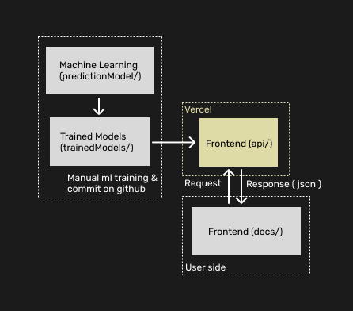

# Diabetes Indicator - Backend
API for the Diabetes Indicator App -> [kmads.dev/github/diabetes-indicator](https://kmads.dev/diabetes-indicator/)<br>
Acess the diabetes-indicator repository here: [kmads.dev/source-code/diabetes-indicator](https://kmads.dev/diabetes-indicator)

```
    diabetes-indicator-backend
    ⊢ trained-models/ 
    |  ⌞ <.pkl files> (models trained and ready for production)
    ⊢ machine-learning/
    |  ⌞ ml.ipynb (python notebook where the models are trained)
    ⊢ main.py (API made with fastapi and uvicorn)
    ⊢ requirements.txt (python dependencies)
    ⊢ vercel.json (vercel deploy config)
    ⌞ README.md
```

### Infra / Architecture
Overview
- **Frontend: [Source](https://source.kmads.dev/diabetes-indicator/) | [Live Deploy](https://kmads.dev/diabetes-indicator/)**
- **Backend + Machine Learning: [Source](https://source.kmadsdev/diabetes-indicator-backend/)**

Flow
- **`client`** Request request prediction from the **`frontend`**
- **`frontend`** gets prediction from **`api/`**
- **`backend`** choose the latest model (.pkl) from **`trained-models/`**
- **`trained-models/`** receives the model (.pkl) from **`machine-learning/`**

Simplified: <br>
- Client -> Frontend <-> Backend -> `<model>.pkl` (trainedModels/)


